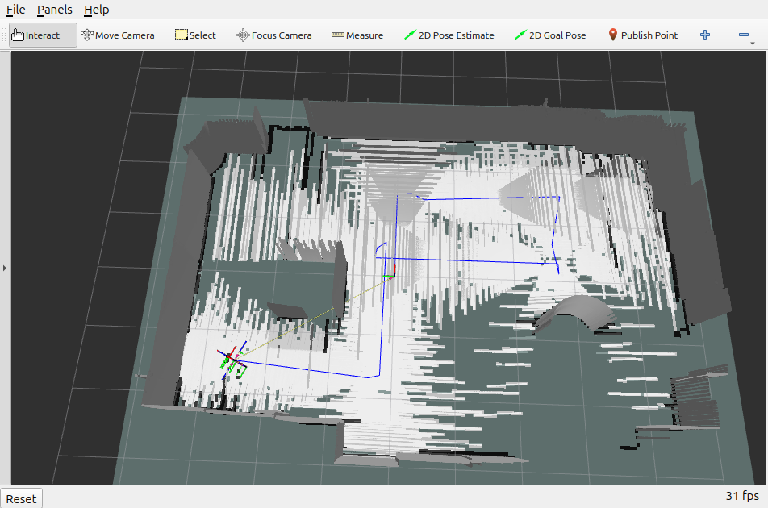
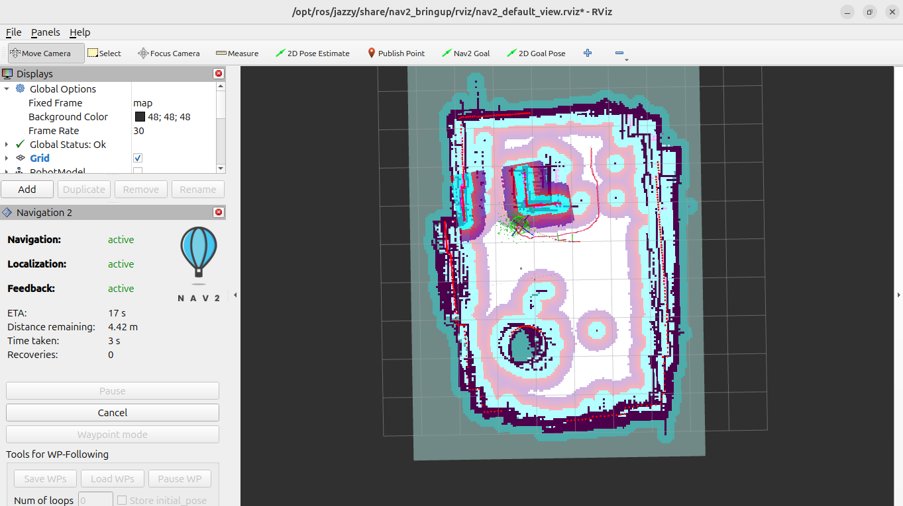
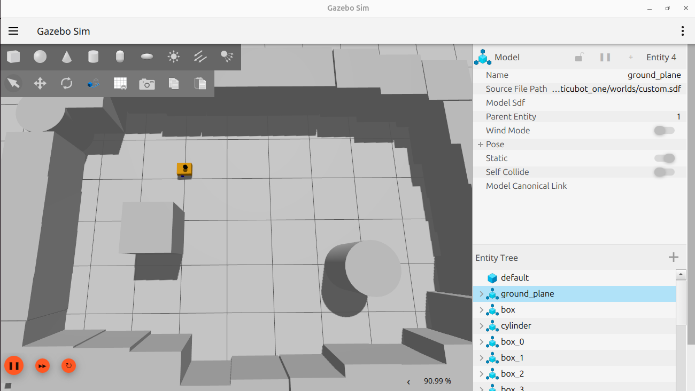

# 🤖 Autonomous Navigation Robot - VSLAM

A ROS 2 Jazzy-based autonomous mobile robot with **Visual SLAM** (RTAB-Map) for 3D mapping and **Nav2** for autonomous navigation in a custom Gazebo simulated environment.







## 🚀 Features

- **Visual SLAM** — RTAB-Map with RGBD camera for 3D mapping and 2D occupancy grid export
- **Autonomous Navigation** — Full Nav2 stack with path planning, obstacle avoidance, and recovery behaviors
- **Custom Gazebo World** — Arena with 32 static obstacle boxes for realistic navigation testing
- **Differential Drive Robot** — Controlled via `ros2_control` with simulated sensors (LiDAR + RGBD camera)
- **AMCL Localization** — Adaptive Monte Carlo Localization using LiDAR on the saved VSLAM map

## 🛠️ Tech Stack

| Component | Technology |
|---|---|
| ROS Distribution | ROS 2 Jazzy |
| Simulation | Gazebo (Harmonic) |
| Visual SLAM | RTAB-Map (`rtabmap_ros`) |
| Navigation | Nav2 (Navigation2) |
| Localization | AMCL |
| Robot Control | `ros2_control` + `diff_drive_controller` |
| Sensors | RGBD Camera, 2D LiDAR |

## 📁 Project Structure

```
├── config/
│   ├── gz_bridge.yaml              # Gazebo-ROS bridge topic mappings
│   ├── nav2_params.yaml            # Nav2 navigation parameters
│   ├── mapper_params_online_async.yaml  # SLAM toolbox config
│   └── twist_mux.yaml             # Velocity command multiplexer
├── description/
│   ├── robot.urdf.xacro           # Main robot URDF
│   ├── depth_camera.xacro         # RGBD camera sensor config
│   └── ros2_control.xacro         # Hardware interface config
├── launch/
│   ├── launch_sim.launch.py       # Gazebo simulation launcher
│   └── navigation_launch.py       # Nav2 navigation launcher
├── maps/
│   ├── my_arena_map.pgm           # Exported 2D occupancy grid
│   └── my_arena_map.yaml          # Map metadata
└── worlds/
    └── custom.sdf                 # Custom Gazebo arena world
```

## 🏗️ Setup

### Prerequisites
```bash
sudo apt install ros-jazzy-navigation2 ros-jazzy-nav2-bringup \
    ros-jazzy-rtabmap-ros ros-jazzy-ros-gz ros-jazzy-twist-mux \
    ros-jazzy-ros2-controllers ros-jazzy-ros2-control
```

### Build
```bash
cd ~/sim_ws
colcon build --symlink-install
source install/setup.bash
```

## 🗺️ Usage

### 1. Launch Gazebo Simulation
```bash
ros2 launch articubot_one launch_sim.launch.py
```

### 2. Visual SLAM — Create a New Map
```bash
ros2 launch rtabmap_launch rtabmap.launch.py \
    rtabmap_args:="--delete_db_on_start" \
    rgb_topic:=/camera/image_raw \
    depth_topic:=/camera/depth/image_raw \
    camera_info_topic:=/camera/camera_info \
    frame_id:=base_link \
    odom_topic:=/diff_cont/odom \
    approx_sync:=true qos:=1 \
    use_sim_time:=true \
    visual_odometry:=false rviz:=true
```
Drive the robot with teleop to explore the environment:
```bash
ros2 run teleop_twist_keyboard teleop_twist_keyboard --ros-args -r cmd_vel:=cmd_vel_joy
```

### 3. Autonomous Navigation — Use Saved Map

**Terminal 1** — Localization:
```bash
ros2 launch nav2_bringup localization_launch.py \
    map:=/path/to/maps/my_arena_map.yaml \
    use_sim_time:=true \
    params_file:=/path/to/config/nav2_params.yaml \
    use_composition:=False
```

**Terminal 2** — Navigation (after setting initial pose in RViz):
```bash
ros2 launch articubot_one navigation_launch.py \
    use_sim_time:=true \
    params_file:=/path/to/config/nav2_params.yaml
```

**Terminal 3** — RViz:
```bash
rviz2 -d /opt/ros/jazzy/share/nav2_bringup/rviz/nav2_default_view.rviz
```

Then in RViz:
1. Click **"2D Pose Estimate"** to set the robot's initial position
2. Wait for AMCL particles to converge
3. Click **"2D Goal Pose"** to send a navigation goal

## 🔧 Pipeline Overview

```
RGBD Camera → RTAB-Map (VSLAM) → 3D Map → Export 2D Grid
                                                ↓
LiDAR → AMCL (Localization) ← 2D Occupancy Grid Map
                ↓
         Nav2 (Path Planning + DWB Controller) → Robot Motion
```

## 📄 License

This project is built upon [articubot_one](https://github.com/joshnewans/articubot_one) by Josh Newans.