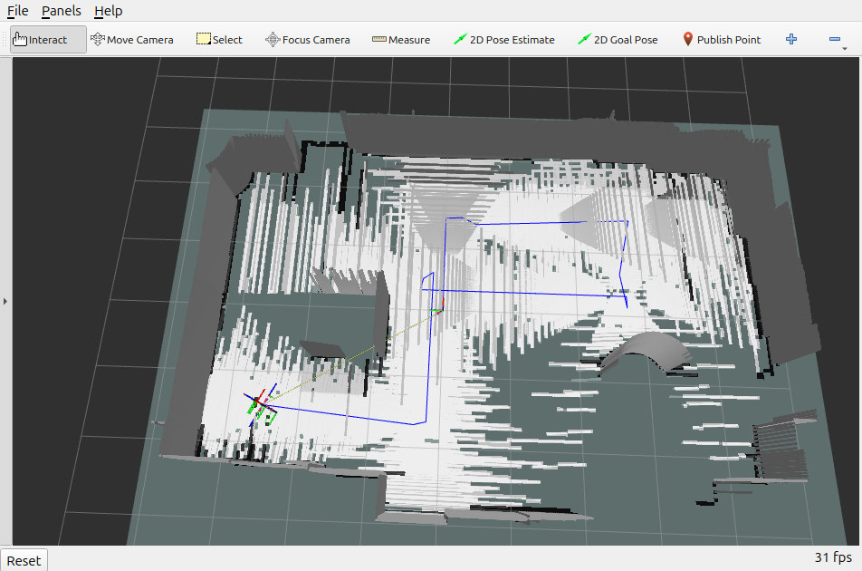
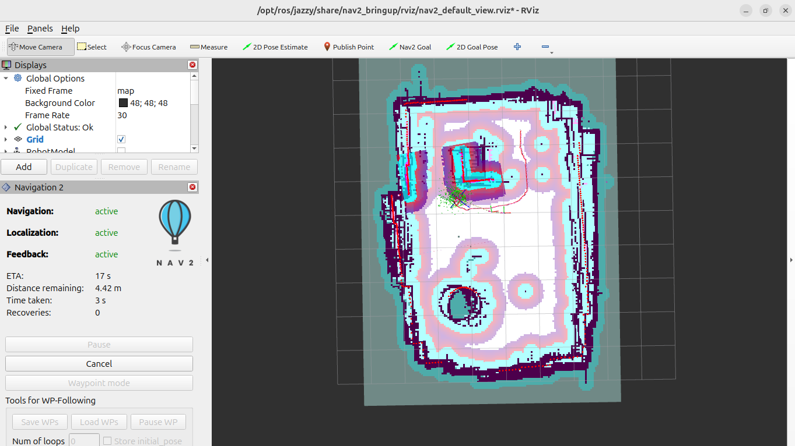
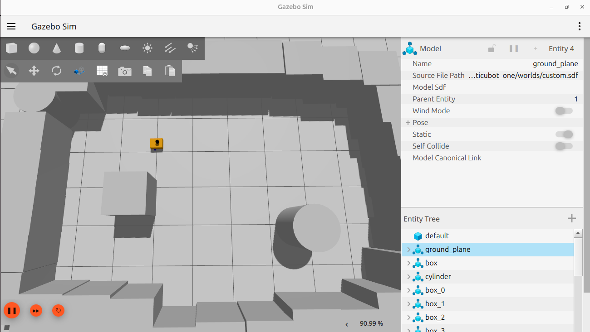

# 🤖 Autonomous Navigation Robot - VSLAM

A ROS 2 Jazzy-based autonomous mobile robot with **Visual SLAM** (RTAB-Map) for 3D mapping and **Nav2** for autonomous navigation in a custom Gazebo simulated environment.







## 🚀 Features

- **Visual SLAM** — RTAB-Map with RGBD camera for 3D mapping and 2D occupancy grid export
- **Autonomous Navigation** — Full Nav2 stack with path planning, obstacle avoidance, and recovery behaviors
- **Custom Gazebo World** — Arena with 32 static obstacle boxes for realistic navigation testing
- **Differential Drive Robot** — Controlled via `ros2_control` with simulated sensors (LiDAR + RGBD camera)
- **AMCL Localization** — Adaptive Monte Carlo Localization using LiDAR on the saved VSLAM map

## 🛠️ Tech Stack

| Component | Technology |
|---|---|
| ROS Distribution | ROS 2 Jazzy |
| Simulation | Gazebo (Harmonic) |
| Visual SLAM | RTAB-Map (`rtabmap_ros`) |
| Navigation | Nav2 (Navigation2) |
| Localization | AMCL |
| Robot Control | `ros2_control` + `diff_drive_controller` |
| Sensors | RGBD Camera, 2D LiDAR |

## 📁 Project Structure

```
├── config/
│   ├── gz_bridge.yaml              # Gazebo-ROS bridge topic mappings
│   ├── nav2_params.yaml            # Nav2 navigation parameters
│   ├── mapper_params_online_async.yaml  # SLAM toolbox config
│   └── twist_mux.yaml             # Velocity command multiplexer
├── description/
│   ├── robot.urdf.xacro           # Main robot URDF
│   ├── depth_camera.xacro         # RGBD camera sensor config
│   └── ros2_control.xacro         # Hardware interface config
├── launch/
│   ├── launch_sim.launch.py       # Gazebo simulation launcher
│   └── navigation_launch.py       # Nav2 navigation launcher
├── maps/
│   ├── my_arena_map.pgm           # Exported 2D occupancy grid
│   └── my_arena_map.yaml          # Map metadata
└── worlds/
    └── custom.sdf                 # Custom Gazebo arena world
```

## 🏗️ Setup

### Prerequisites
```bash
sudo apt update
sudo apt install -y \
    ros-jazzy-navigation2 \
    ros-jazzy-nav2-bringup \
    ros-jazzy-rtabmap-ros \
    ros-jazzy-ros-gz \
    ros-jazzy-ros-gz-sim \
    ros-jazzy-ros-gz-bridge \
    ros-jazzy-ros-gz-interfaces \
    ros-jazzy-gz-ros2-control \
    ros-jazzy-twist-mux \
    ros-jazzy-twist-stamper \
    ros-jazzy-ros2-controllers \
    ros-jazzy-ros2-control \
    ros-jazzy-teleop-twist-keyboard
```

⚠️ Troubleshooting: Middleware FastDDS Binary Loop Fix

If you encounter a symbol lookup error stemming from libcontroller_manager_msgs and FastDDS during Gazebo controller initialization (causing the controller spawner nodes to time out or hang), run an explicit package upgrade to force synchronization of your underlying middleware dependencies:

```
sudo apt update
sudo apt install --only-upgrade ros-jazzy-fastrtps ros-jazzy-rmw-fastrtps-cpp ros-jazzy-rosidl-typesupport-fastrtps-cpp -y
sudo apt dist-upgrade -y
```

##Create Workspace & Build

Create your workspace directory, clone the project files, resolve dependencies via rosdep, and build:
```
mkdir -p ~/sim_ws/src
cd ~/sim_ws/src
git clone [https://github.com/akhiljithvg/Autonomous-Navigation-Robot-VSLAM.git](https://github.com/akhiljithvg/Autonomous-Navigation-Robot-VSLAM.git)

cd ~/sim_ws
rosdep update
rosdep install --from-paths src --ignore-src -r -y

colcon build --symlink-install
source install/setup.bash

```
💡 Tip: Add source ~/sim_ws/install/setup.bash to your ~/.bashrc file to automatically source the workspace in every new shell session.

## 🗺️ Usage

### 1. Launch Gazebo Simulation
```bash
ros2 launch articubot_one launch_sim.launch.py
```

### 2. Visual SLAM — Create a New Map
```bash
ros2 launch rtabmap_launch rtabmap.launch.py \
    rtabmap_args:="--delete_db_on_start" \
    rgb_topic:=/camera/image_raw \
    depth_topic:=/camera/depth/image_raw \
    camera_info_topic:=/camera/camera_info \
    frame_id:=base_link \
    odom_topic:=/diff_cont/odom \
    approx_sync:=true qos:=1 \
    use_sim_time:=true \
    visual_odometry:=false rviz:=true
```
Drive the robot with teleop to explore the environment:
```bash
ros2 run teleop_twist_keyboard teleop_twist_keyboard --ros-args -r cmd_vel:=cmd_vel_joy
```

## Exporting and Saving Your Map

Once you are satisfied with the map generated in RViz, you need to save it before shutting down the simulation. Open a new terminal and run the Nav2 map saver:

```
ros2 run nav2_map_server map_saver_cli -f ~/sim_ws/src/Autonomous-Navigation-Robot-VSLAM/maps/my_arena_map --ros-args -r map:=/rtabmap/map
```
This will automatically generate two files in your maps/ directory:

    my_arena_map.pgm (The 2D occupancy grid image)

    my_arena_map.yaml (The metadata configuration file required by AMCL)

(Optional) To back up RTAB-Map's core 3D SLAM database file into the repository, copy it using:
```
cp ~/.ros/rtabmap.db ~/sim_ws/src/Autonomous-Navigation-Robot-VSLAM/maps/my_arena_db.db
```
⚠️ Crucial Step for Portability: By default, the map saver hardcodes your system's absolute directory path inside the generated .yaml file. To ensure the map loads correctly across different machines or usernames, open maps/my_arena_map.yaml and modify the first line (image:) to use a relative path instead:

```
image: my_arena_map.pgm
resolution: 0.05
origin: [-4.225, -5.65126, 0.0]
...
```
### 3. Autonomous Navigation — Use Saved Map

1. Close Everything First

Shut down all of your active mapping terminals (the ones running rtabmap.launch.py and teleop_twist_keyboard). This clears out the old SLAM nodes so they don't fight with Nav2 over the robot's control topics.

2. Open Terminal 1: Launch the Gazebo Simulation

Always start the simulation environment first. The physics engine and the robot description state publishers need to be alive so that the navigation nodes can immediately see the robot's simulated sensor data stream (LiDAR /scan and TF transforms).
```
ros2 launch articubot_one launch_sim.launch.py
```
Wait until the Gazebo GUI window fully renders and you see your robot sitting in the arena.

3. Open Terminal 2 & 3: Launch Localization & Navigation

Now that the simulation is providing active clock and sensor data, bring up your navigation stack brains.

In a new terminal, launch AMCL Localization:
```
ros2 launch nav2_bringup localization_launch.py \
    map:=~/sim_ws/src/Autonomous-Navigation-Robot-VSLAM/maps/my_arena_map.yaml \
    use_sim_time:=true \
    params_file:=~/sim_ws/src/Autonomous-Navigation-Robot-VSLAM/config/nav2_params.yaml \
    use_composition:=False
```
In another terminal, launch Nav2 Navigation:

```
ros2 launch articubot_one navigation_launch.py \
    use_sim_time:=true \
    params_file:=~/sim_ws/src/Autonomous-Navigation-Robot-VSLAM/config/nav2_params.yaml
```

4. Open Terminal 4: Open RViz (The Visualizer)

Open RViz last. RViz is just a window to look at what your running nodes see. Opening it last ensures that the /map topic is already active from your localization node, so the background loads immediately without errors.
```
rviz2 -d /opt/ros/jazzy/share/nav2_bringup/rviz/nav2_default_view.rviz
```
Once RViz opens:

  1. Make sure your Fixed Frame is set to map.

  2. Use the 2D Pose Estimate button at the top to tell the robot where it is sitting in Gazebo.

  3. Use 2D Goal Pose to send it driving autonomously!


## 🔧 Pipeline Overview

```
RGBD Camera → RTAB-Map (VSLAM) → 3D Map → Export 2D Grid
                                                ↓
LiDAR → AMCL (Localization) ← 2D Occupancy Grid Map
                ↓
         Nav2 (Path Planning + DWB Controller) → Robot Motion
```

## 📄 License

This project is built upon [articubot_one](https://github.com/joshnewans/articubot_one) by Josh Newans.
